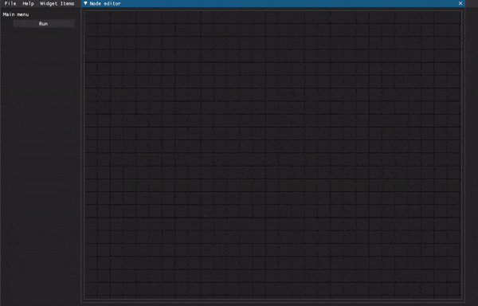
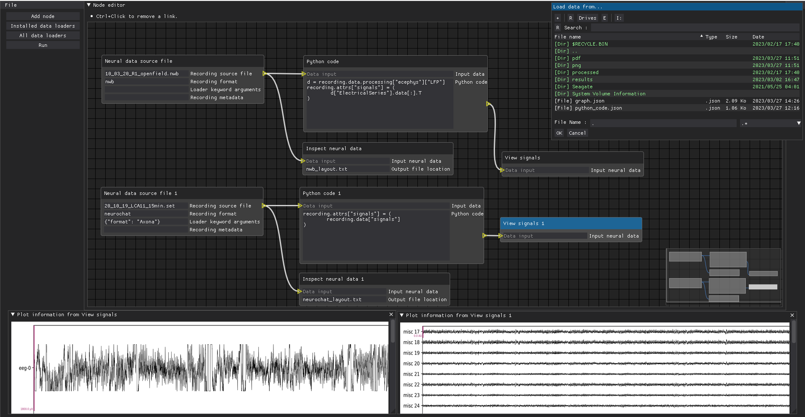

# Simuran

[](https://simuran.readthedocs.io/en/latest/?badge=latest)
[](https://sonarcloud.io/summary/new_code?id=seankmartin_SIMURAN)
[](https://codecov.io/gh/seankmartin/SIMURAN)
[](https://codeclimate.com/github/seankmartin/SIMURAN/maintainability)
[](https://github.com/psf/black)
[](https://zenodo.org/badge/latestdoi/248264803)
[](https://www.gnu.org/licenses/gpl-3.0)



To see more details than in the README, our [read the docs](https://simuran.readthedocs.io/en/latest/) site, or the PhD thesis of Sean K. Martin.

## Installation

```console
pip install simuran
```

### MAC OS

- To use the UI, you will need to perform at least the following - `brew install libpng`.
- It is possible you may also need the MAC command line developer tools.

## Usage

### Objective

Simuran can help facilitate batch processing of many neural recordings in an easy to handle way.

The main objects to setup are Recordings (containing all information relevant to an experiment, or part of an experiment) and RecordingContainers, which are a series of Recordings.
For instance, a RecordingContainer could represent all t-maze running speed, spikes, etc. and associated metadata, while a Recording is an individual t-maze session.
This can then support easy extraction of subcontainers, such as, all trials which were successful in mice expressing a particular gene.

### API

The API is built around the Recording and RecordingContainer classes, for instance, one way to load an NWB file is as follows:

```python
import simuran

recording = simuran.Recording(
    source_file=PATH_TO_NWB, loader=simuran.loader("NWB"))
recording.load()
recording.inspect() # See what was loaded
```

The Recording class is designed to be as flexible as possible, and can be used to load any data, as long as a loader is provided.
The loader is a class which takes a Recording object and loads the data into it.
Other modules include the analysis module, which allows multi-processing of analysis functions, and the base module, which contains the base classes for the API.
The plot module contains plotting functions for general use, and also some simple figure handling (auto garbage collection, etc.).
Finally, the bridge module contains Bridge class definitions, which are used to allow interoperability between different software tools and data formats in neuroscience.

### GUI - Visual node based editor

Here, the focus is mostly on the Recording level, but multiple recordings can be bundled as blocks.

Recordings are loaded and processed via Nodes which are established through the UI and run in a digraph fashion.
The UI is built using dearpygui, and supports a subset of the API via nodes, which can be expanded upon.



### Examples

Some examples are provided in the examples folder.

## Contributing

Contributions are welcome, and any issues can be raised on the github page. Please feel free to reach out to me if you have any questions.

## License

Simuran is distributed under the GPL-3.0 License.

## Citation

If you use Simuran in your work, please cite the following:
Sean Martin, & Shane O'Mara. (2023). seankmartin/Simuran: Simuran 23.08.0 (23.08.0). Zenodo. <https://doi.org/10.5281/zenodo.8224426>

## Inspiration

1. [NeuroChaT: Analysis toolset with GUI for Neuroscience](https://github.com/seankmartin/NeuroChaT)
2. [SpikeInterface · GitHub](https://github.com/SpikeInterface)
3. [A set of python neuroscience scripts which rely on the NeuroChaT API](https://github.com/seankmartin/NeuroChaT_API_Scripts)
4. [MNE: Magnetoencephalography (MEG) and Electroencephalography (EEG) in Python](https://github.com/mne-tools/mne-python/)
5. [Sumatra - NeuralEnsemble](http://neuralensemble.org/sumatra/)
6. [Snakemake](https://snakemake.readthedocs.io/en/stable/)

## Update coverage

```console
pytest .
codecov -t ba31944a-6070-401e-a731-1bd2f92a5e55
```
