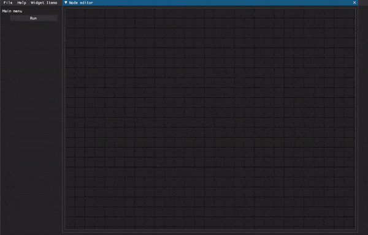

# SIMURAN

[](https://simuran.readthedocs.io/en/latest/?badge=latest)
[](https://app.travis-ci.com/github/seankmartin/SIMURAN)
[](https://sonarcloud.io/summary/new_code?id=seankmartin_SIMURAN)
[](https://codecov.io/gh/seankmartin/SIMURAN)
[](https://codeclimate.com/github/seankmartin/SIMURAN/maintainability)
[](https://github.com/psf/black)
[](https://www.gnu.org/licenses/gpl-3.0)



Simultaneous Multi-Region Analysis.
The general design is to have single objects with large amounts of information and an intuitive system to set this up.

## OS specific setup

### MAC OS

- To use the UI, you will need to perform at least the following. brew install libpng
- It is possible you may also need the MAC command line developer tools, but perhaps not.
- To use doit on MAC, you will need the developer tools.

### Extra functionality

On top of the true requirements for this package.

1. sumatra: see my repositories, allows for tracking runs of the code.
2. gitpython: also git. Allows sumatra to check your version control (assuming using git and svn etc.)
3. doit: PyPI, allows for setting up experiments with version tracking like mac.
4. d-tale: Pandas table autovisualisation.

## Objective

A project may function like so:

1. Project exploration. Metadata handling etc.

Describe what is in your data and facilitate batch processing.
Provide some analysis methods and allow for easy creation of further analyses.

## Installation

```Bash
git clone https://github.com/seankmartin/SIMURAN
cd SIMURAN
pip install -e .
git clone https://github.com/seankmartin/sumatra
cd sumatra
pip install -e .
pip install GitPython
pip install doit
```

## Quick start

To start the UI demo just type`simuran-ui`

Download files from TBD into simuran_analysis.

```Bash
cd simuran_analysis
git init
git add .
git commit -m "Initial commit of analysis project"
smt init sumatra_project
simuran TBD
smtweb &
```

## Requirements

Listed in requirements.txt.
Just in case version conflicts come up, the last known set of working packages is in frozen.txt

## Ideas

Interface with other programs such as SpikeInterface to allow for many different systems and sorters to be used.

## Information in an experiment

1. Date and time
2. Channel map (like spike sorters)
3. Parameters file

## Information in a signal

1. Date and time (or just time).
2. Region
3. Geometrical Location
4. Tag
5. Source data location
6. File format
7. Description
8. Sampling rate
9. Duration
10. Data type

## Using custom analysis code

SIMURAN can use any code that is on the Python path. The easiest way to manage this is to either:
1. Fork SIMURAN and place your custom analysis code in the SIMURAN package under the directory labelled custom.
2. Place your code on path separately, such as by creating a `setup.py` file for your code, or a `pyproject.toml` file for installation.
3. If you place python code and/or a file with the `.pth` extension in a directory named analysis in the same directory that batch_config_path is in, this `.pth` file will be automatically processed and its contents placed on path. If this option is chosen, it is recommended to store the analysis functions directly so that anyone can run the code without modification.
4. See [examples](https://github.com/seankmartin/neuro-tools/tree/master/SIMURAN).

## Inspiration

1. [GitHub - seankmartin/NeuroChaT: Analysis toolset with GUI for Neuroscience](https://github.com/seankmartin/NeuroChaT)
2. [SpikeInterface · GitHub](https://github.com/SpikeInterface)
3. [GitHub - seankmartin/NeuroChaT_API_Scripts: A set of python neuroscience scripts which rely on the NeuroChaT API](https://github.com/seankmartin/NeuroChaT_API_Scripts)
4. [GitHub - mne-tools/mne-python: MNE: Magnetoencephalography (MEG) and Electroencephalography (EEG) in Python](https://github.com/mne-tools/mne-python/)
5. [Sumatra - NeuralEnsemble](http://neuralensemble.org/sumatra/)

## Todo List

1. TODO check todo within code.
2. TODO turn back on the analysis tests
3. TODO Create more tests for core elements, such as figures.
4. TODO Clean up CLI, too many arguments currently. Could probably split into other scripts.
5. Use CSV instead of excel by default, faster read and write times.

See synk for security vulnerabilities.
